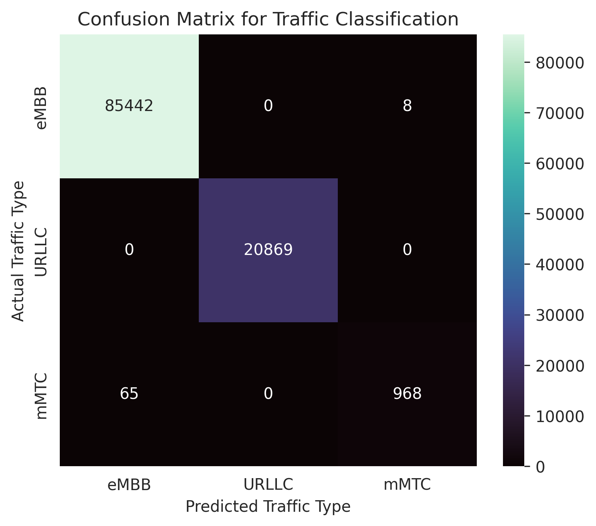
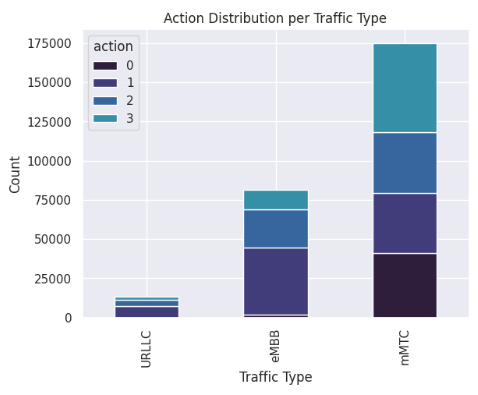

# SDN-Based-Traffic-Classification-AIML
SDN-based traffic classification using Mininet, RYU controller, and machine learning to differentiate real-time and bulk flows.
# 5G-Like Traffic Generation Using SDN (Mininet + RYU)

This document records the complete workflow and commands used to generate 5G-like traffic patterns using Mininet, RYU SDN Controller, and iperf3. The goal is to emulate eMBB, URLLC, and mMTC services in a controlled SDN environment.

---

## Step 1: Start the SDN Controller (Control Plane)

The SDN control plane is started using the RYU controller. A Python virtual environment is activated before launching the controller.

**Commands:**
```bash
source ~/ryuenv/bin/activate
ryu-manager ryu.app.simple_switch_13
```

*This initializes the SDN control plane and enables OpenFlow communication between the controller and Open vSwitch.*

---

## Step 2: Create the Mininet Network (Data Plane)

Mininet is used to create the SDN data plane. A tree topology is chosen to emulate a 5G-like core–access network structure.


**Command:**
```bash
sudo mn --controller=remote --topo=tree,depth=2,fanout=3 --switch=ovs
```

**This command:**
* Creates multiple Open vSwitch instances
* Builds a hierarchical topology
* Connects all switches to the remote RYU controller
* Treats hosts as UEs or IoT devices

---

## Step 3: Verify Network Connectivity

Before generating traffic, connectivity between all hosts is verified.

**Command:**
```bash
mininet> pingall
```

**Expected output:**
0% packet loss (Confirms that the SDN topology is correctly configured and stable).

---

## Step 4: Generate eMBB Traffic (High Throughput)

To emulate eMBB (Enhanced Mobile Broadband) traffic, TCP-based high-throughput traffic is generated.

1. Start an iperf3 server on host h1:
   ```bash
   mininet> h1 iperf3 -s &
   ```

2. Generate TCP traffic from host h2 to host h1:
   ```bash
   mininet> h2 iperf3 -c h1 -t 20
   ```

3. Save and view the output for analysis:
   ```bash
   mininet> h2 iperf3 -c h1 -t 20 > embb.txt
   mininet> h2 cat embb.txt
   ```

*This traffic represents 5G eMBB, characterized by sustained high bandwidth usage.*

---

## Step 5: Generate URLLC Traffic (Low Latency)

To emulate URLLC (Ultra-Reliable Low-Latency Communication), UDP traffic with controlled bandwidth is generated.

**Command:**
```bash
mininet> h3 iperf3 -u -b 1M -c h1 -t 20
```

**This traffic characteristics:**
* Uses UDP instead of TCP
* Maintains low latency
* Sends small packets
* Uses controlled bandwidth

---

## Step 6: Generate mMTC Traffic (IoT-Type Communication)

To emulate mMTC (Massive Machine-Type Communication), frequent small packets are generated using ICMP.

**Command:**
```bash
mininet> h4 ping h1 -i 0.2 -c 50
```

**Observed behavior:**
* RTT ≈ 0.05–0.07 ms
* 0% packet loss
* Reflects IoT-style communication with small packet sizes and high frequency.

---

## Traffic Validation Summary

The generated traffic patterns are clearly distinguishable:

| Service Type | Protocol | Characterization |
| :--- | :--- | :--- |
| eMBB | TCP | High-throughput / Large Data Transfer |
| URLLC | UDP | Low-latency / High Reliability |
| mMTC | ICMP | Massive connections / Small frequent packets |

---

## Final Status

**Completed tasks:**
- SDN controller initialized
- Mininet topology created
- Network connectivity verified
- eMBB traffic generated
- URLLC traffic generated
- mMTC traffic generated
- Traffic behavior validated

**Pending tasks:**
- Flow statistics collection
- Dataset creation (CSV)
- Machine learning classification
# 📊 Real-Time Flow Statistics Collection using SDN

This section documents the complete workflow and commands used to collect real-time OpenFlow flow statistics from an SDN network using Mininet and the RYU controller. These flow statistics are later used to build a machine-learning dataset for traffic classification.

---

## 🧠 Objective
To collect real-time flow-level statistics (packet count, byte count, flow duration) from a live SDN network while 5G-like traffic (eMBB, URLLC, mMTC) is actively flowing.

---

## 🏗️ Experimental Setup
* **SDN Controller:** RYU (OpenFlow 1.3)
* **Data Plane:** Mininet with Open vSwitch
* **Topology:** Tree topology (depth=2, fanout=3)
* **Traffic Generator:** iperf3 (TCP/UDP), ping (ICMP)
* **Monitoring:** Periodic OpenFlow FlowStatsRequest (1-second interval)
* **Output:** Real-time CSV dataset

---

## 🔹 Step 1: Activate Python Virtual Environment
Before starting the SDN controller, the Python virtual environment containing RYU and required dependencies is activated.

**Command:**
```bash
source ~/ryuenv/bin/activate
```

* ✔ Ensures correct RYU version
* ✔ Prevents dependency conflicts

---

## 🔹 Step 2: Start the Real-Time Flow Statistics Controller
A custom RYU controller application (`flow_stats_realtime.py`) is launched. This controller performs L2 packet forwarding, periodic statistics collection (1s interval), and real-time CSV writing.

**Commands:**
```bash
cd ~/ryu_apps
ryu-manager flow_stats_realtime.py
```

* ✔ Controller initializes the SDN control plane
* ✔ Flow monitoring starts immediately
* ✔ CSV file (`flow_stats.csv`) is created
* *Note: This terminal must remain running throughout the experiment.*

---

## 🔹 Step 3: Clean Previous Mininet State
Remove leftover Mininet state to avoid conflicts.

**Command:**
```bash
sudo mn -c
```
---

## 🔹 Step 4: Start Mininet Data Plane (5G-Like Topology)
Launch Mininet with a tree topology to emulate a hierarchical 5G-like network.


**Command:**
```bash
sudo mn \
--controller=remote,ip=127.0.0.1,port=6653 \
--switch=ovs,protocols=OpenFlow13 \
--topo=tree,depth=2,fanout=3
```
---

## 🔹 Step 5: Verify Network Connectivity
**Command:**
```bash
mininet> pingall
```

**Expected Output:**
`0% packet loss` (Confirms correct controller–switch–host communication).

---

## 🔹 Step 6: Start Traffic Sink (Server)
Host h1 is configured as the central server (5G core).

**Command:**
```bash
mininet> h1 iperf3 -s &
```

---

## 🔹 Step 7: Generate eMBB Traffic (High Throughput)
eMBB traffic is emulated using long-lived TCP flows.

**Commands:**
```bash
mininet> h2 iperf3 -c h1 -t 600 &
mininet> h3 iperf3 -c h1 -t 600 &
mininet> h4 iperf3 -c h1 -t 600 &
```

* **Characteristics:** High bandwidth, large byte counts, long-duration flows.

---

## 🔹 Step 8: Generate URLLC Traffic (Low Latency)
URLLC traffic is generated using UDP with controlled bandwidth.

**Commands:**
```bash
mininet> h5 iperf3 -u -b 1M -c h1 -t 600 &
mininet> h6 iperf3 -u -b 500K -c h1 -t 600 &
```

* **Characteristics:** Low latency, smaller payloads, high reliability.

---

## 🔹 Step 9: Generate mMTC Traffic (IoT-Like)
mMTC traffic is emulated using frequent ICMP packets.

**Commands:**
```bash
mininet> h7 ping h1 -i 0.2 -c 3000 &
mininet> h8 ping h1 -i 0.3 -c 2000 &
mininet> h9 ping h1 -i 0.4 -c 1500 &
```

* **Characteristics:** Small packets, high frequency, massive transmissions.

---

## 🔹 Step 10: Real-Time Flow Statistics Collection
While traffic runs, the RYU controller:
1. Sends `FlowStatsRequest` every 1 second.
2. Receives live flow counters.
3. Writes statistics continuously to CSV.

*⏱ Allow traffic to run for 10–15 minutes.*

---

## 🔹 Step 11: Stop Experiment
**Commands:**
```bash
mininet> exit
```
# Press Ctrl + C in the RYU terminal to stop the controller

---

## 🔹 Step 12: Verify Dataset Size
**Command:**
```bash
wc -l flow_stats.csv
```

**Example Output:**
`536761 flow_stats.csv`

---

## 🔹 Step 13: Backup Raw Dataset
**Command:**
```bash
cp flow_stats.csv flow_stats_raw_536k.csv
```
---

## 📊 Dataset Description
* **Format:** CSV
* **Collection Mode:** Real-time (online)
* **Features:** Packet count, Byte count, Flow duration, Timestamp
* **Dataset Size:** 536,000+ rows

---

## ✅ Summary
* ✔ Real-time SDN monitoring implemented
* ✔ Large-scale dataset generated
* ✔ Concurrent 5G-like traffic emulated
* ✔ Ready for ML classification

# SDN Traffic Classification using LightGBM

This project performs **traffic classification in an SDN network** using **machine learning**. Flow statistics are collected from an SDN environment built with **Mininet and the RYU controller**, and a **LightGBM model** is trained to classify traffic into:

```
eMBB
URLLC
mMTC
```

---

# 1. Load the Raw Flow Statistics Dataset

The raw dataset collected from the SDN controller is stored as:

```
flow_stats_raw_536k.csv
```

## Command

```python
import pandas as pd

df = pd.read_csv("flow_stats_raw_536k.csv")
```

## Why

This dataset contains **OpenFlow flow statistics** collected during traffic generation experiments.

Example raw features:

```
dpid
src_ip
dst_ip
packet_count
byte_count
duration_sec
```

These metrics describe **basic network flow behaviour**.

---

# 2. Remove Non-Behavioral Features

Certain columns are removed before training.

## Command

```python
df = df.drop(columns=["src_ip","dst_ip"])
```

## Why

IP addresses represent **flow identity**, not **traffic behaviour**.

Keeping them can cause the model to **memorize flows instead of learning patterns**.

---

# 3. Feature Engineering

To improve classification performance, several traffic behaviour features are derived.

---

## Packet Rate

### Command

```python
df["packet_rate"] = df["packet_count"] / df["duration_sec"]
```

### Why

Packet rate indicates **how frequently packets are transmitted**.

Typical behaviour:

```
mMTC → low packet rate
URLLC → moderate packet rate
eMBB → high packet rate
```

---

## Byte Rate

### Command

```python
df["byte_rate"] = df["byte_count"] / df["duration_sec"]
```

### Why

Byte rate represents **data transfer speed**.

---

## Throughput

### Command

```python
df["throughput"] = df["byte_rate"] * 8
```

### Why

Throughput measures **bits per second (bps)** and helps identify high-bandwidth flows.

---

## Average Packet Size

### Command

```python
df["avg_packet_size"] = df["byte_count"] / df["packet_count"]
```

### Why

Different traffic types use different packet sizes:

```
eMBB → large packets
URLLC → medium packets
mMTC → small packets
```

---

## Flow Intensity

### Command

```python
df["flow_intensity"] = df["packet_rate"] * df["avg_packet_size"]
```

### Why

Captures **traffic burst behaviour**.

---

## Log Transformations

### Command

```python
import numpy as np

df["log_byte_count"] = np.log1p(df["byte_count"])
df["log_throughput"] = np.log1p(df["throughput"])
```

### Why

Log transformations help:

```
reduce skewed distributions
improve model stability
```

---

# 4. Save the Engineered Dataset

## Command

```python
df.to_csv("traffic_dataset_features_final.csv", index=False)
```

## Why

This separates the **raw dataset** from the **machine learning dataset** and improves reproducibility.

Final dataset size:

```
536,760 flow records
```

---

# 5. Prepare Data for Machine Learning

## Command

```python
df = pd.read_csv("traffic_dataset_features_final.csv")

X = df.drop(columns=["label"])
y = df["label"]
```

## Why

Machine learning models require:

```
X → input features
y → target labels
```

Labels represent traffic types:

```
eMBB
URLLC
mMTC
```

---

# 6. Train-Test Split

## Command

```python
from sklearn.model_selection import train_test_split

X_train, X_test, y_train, y_test = train_test_split(
    X, y,
    test_size=0.2,
    random_state=42
)
```

## Why

Splitting the dataset ensures the model is evaluated on **unseen data**, preventing overfitting.

Dataset split:

```
80% training
20% testing
```

---

# 7. Train the LightGBM Model

## Command

```python
import lightgbm as lgb

model = lgb.LGBMClassifier(
    n_estimators=200,
    learning_rate=0.05,
    max_depth=8
)

model.fit(X_train, y_train)
```

## Why LightGBM

LightGBM performs well on:

```
large tabular datasets
correlated features
high-dimensional network data
```

---

# 8. Predict Traffic Classes

## Command

```python
y_pred = model.predict(X_test)
```

## Why

The trained model predicts whether each network flow belongs to:

```
eMBB
URLLC
mMTC
```

---

# 9. Evaluate Model Accuracy

## Command

```python
from sklearn.metrics import accuracy_score

accuracy = accuracy_score(y_test, y_pred)

print("Accuracy:", accuracy)
```

---

# Model Performance

| Metric    | Score   |
|-----------|----------|
| Accuracy  | 99.93%  |
| Precision | 99.93%  |
| Recall    | 99.93%  |
| F1 Score  | 99.93%  |

The LightGBM model achieves very high classification performance, demonstrating that flow-level statistical features can effectively distinguish between **eMBB**, **URLLC**, and **mMTC** traffic types.

---

# 10. Visualization and Analysis

Several visualizations were created to understand dataset behaviour and model performance.

---

## Traffic Type Distribution

<p align="center">

</p>

This plot shows the number of flows for each traffic category.

---

## Traffic Behaviour (Packet Rate vs Throughput)

<p align="center">

</p>

The scatter plot demonstrates how traffic types exhibit different statistical patterns.

---

## Feature Correlation Heatmap

<p align="center">

</p>

The heatmap shows relationships between engineered traffic features.

---

## Feature Importance

<p align="center">

</p>

This visualization highlights the features most influential for classification.

---

## Confusion Matrix

<p align="center">

</p>

The confusion matrix shows how accurately the model distinguishes between traffic types.

---

# Reinforcement Learning Based QoS Optimization

After traffic classification using LightGBM, a Reinforcement Learning agent is used to dynamically optimize Quality of Service (QoS) parameters in the SDN network.

The classified traffic type and network flow statistics are provided as the state to a Proximal Policy Optimization (PPO) agent.

The RL agent learns to dynamically select QoS policies for different traffic conditions.

---

# 11. Prepare Traffic Data for Reinforcement Learning

The engineered traffic dataset and trained LightGBM classifier are loaded.

## Command

    import pandas as pd
    import joblib

    df = pd.read_csv("traffic_dataset_features_final.csv")
    lgb_model = joblib.load("traffic_classifier_lightgbm.pkl")

    df = df.drop_duplicates()
    df = df.replace([np.inf, -np.inf], np.nan)
    df = df.dropna()

    data = df.sample(8000).reset_index(drop=True)

## Why

The RL environment uses real traffic flow statistics collected from the SDN network.

Invalid and duplicate samples are removed before training.

A subset of traffic flows is used to create the reinforcement learning environment.

---

# 12. Normalize Network Features

Network features have different numerical ranges. Min-Max normalization is applied before providing the state to the RL agent.

## Command

    from sklearn.preprocessing import MinMaxScaler

    scaler = MinMaxScaler()
    data[features] = scaler.fit_transform(data[features])

## Why

Normalization ensures that features such as packet count, throughput, and burst ratio contribute consistently to the RL state.

---

# 13. Define the RL State Space

The RL state consists of network flow statistics and the traffic class predicted by the LightGBM model.

State features include:

    dpid
    packet_count
    byte_count
    duration_sec
    byte_rate
    packet_rate
    avg_packet_size
    throughput
    flow_intensity
    burst_ratio
    log_byte_count
    log_throughput
    predicted traffic class

The LightGBM classifier predicts whether the current flow belongs to:

    eMBB
    URLLC
    mMTC

The predicted traffic class is appended to the network state.

---

# 14. Define the QoS Action Space

The RL agent selects one of four QoS policies.

Each action represents:

    [Priority, Bandwidth Allocation, Queue Parameter]

## Actions

    Action 0 → [0.8, 0.2, 0.2]
    Action 1 → [0.5, 0.8, 0.4]
    Action 2 → [0.3, 0.3, 0.9]
    Action 3 → [0.6, 0.6, 0.6]

These actions allow the agent to dynamically modify traffic handling behaviour.

The selected action affects:

- Packet processing priority
- Bandwidth allocation
- Queue behaviour

---

# 15. Create the SDN Reinforcement Learning Environment

A custom Gymnasium environment is created to simulate dynamic QoS optimization.

## Environment

    class SDNEnv(gym.Env):

        def __init__(self, data):
            super().__init__()

            self.data = data
            self.index = 0
            self.last_action = None

            self.observation_space = spaces.Box(
                low=0,
                high=1,
                shape=(len(features) + 1,),
                dtype=np.float32
            )

            self.action_space = spaces.Discrete(len(actions))

The environment performs three major operations:

1. Observe the current network state
2. Select a QoS action
3. Calculate a reward based on network performance

---

# 16. Reward Function

The RL agent receives a reward based on multiple network performance metrics.

Reward components include:

    Throughput Gain
    Delay Reduction
    Packet Loss Reduction
    Traffic Stability
    Network Efficiency

The reward encourages the agent to:

- Increase throughput
- Reduce latency
- Reduce burst behaviour
- Improve network stability
- Improve resource efficiency

Repeated selection of the same action is slightly penalized to encourage policy exploration.

The final reward is normalized and bounded before being returned to the PPO agent.

---

# 17. Train the PPO Agent

Proximal Policy Optimization (PPO) is used to learn the QoS control policy.

## Command

    from stable_baselines3 import PPO

    env = SDNEnv(data)

    model = PPO(
        "MlpPolicy",
        env,
        learning_rate=3e-4,
        n_steps=2048,
        batch_size=128,
        gamma=0.99,
        ent_coef=0.03,
        vf_coef=1.0,
        verbose=1
    )

    model.learn(total_timesteps=120000)

    model.save("rl_qos_agent")

## Why PPO

PPO provides stable policy updates and is suitable for dynamic network control environments.

The agent continuously interacts with the SDN environment and learns QoS policies that maximize cumulative reward.

---

# PPO Training Performance

| Parameter | Value |
|---|---:|
| Total Timesteps | 120,832 |
| Average Episode Length | 8000 |
| Average Episode Reward | 992 |
| FPS | 168 |
| Learning Rate | 0.0003 |
| KL Divergence | 0.0146 |
| Clip Fraction | 0.061 |
| Entropy Loss | -1.05 |
| Policy Gradient Loss | -0.00317 |
| Value Loss | 2.08 |

The PPO training statistics indicate stable learning behaviour and controlled policy updates.

---

# 18. Evaluate the RL Agent

The trained PPO agent is evaluated over multiple network states.

## Command

    actions_taken = []
    rewards = []

    obs, _ = env.reset()

    for _ in range(2000):

        action, _ = model.predict(obs)
        action = int(action)

        obs, reward, done, _, _ = env.step(action)

        actions_taken.append(action)
        rewards.append(reward)

The selected actions and rewards are recorded for performance analysis.

---

# RL Reward Analysis


The reward increases during training, indicating that the PPO agent gradually learns improved QoS policies.

---

# Throughput and Latency Analysis

The trained RL agent produces different network behaviour for each traffic category.

| Traffic Type | Throughput | Latency |
|---|---:|---:|
| URLLC | 3.76 × 10³ | 0.163 |
| eMBB | 1.99 × 10¹⁰ | 0.044 |
| mMTC | 5.83 × 10¹ | 2657.43 |

## Observations

- **eMBB** achieves the highest throughput, supporting high-bandwidth applications.
- **URLLC** maintains low latency suitable for real-time communication.
- **mMTC** has lower throughput and higher latency due to IoT-style traffic characteristics.

---

# Throughput Variation Over Time


The throughput remains stable with minor fluctuations.

This indicates that the RL agent adapts to changing network conditions while maintaining network performance.

---

# Action Distribution Across Traffic Types



Different traffic classes receive different QoS actions.

The PPO agent learns traffic-specific resource allocation behaviour instead of applying a single static policy.

---

# Distribution of RL Actions


The distribution of selected actions demonstrates exploration of multiple QoS policies.

---

# RL Actions Over Time


The RL agent dynamically changes its selected action across network states.

This demonstrates adaptive QoS decision-making based on changing traffic conditions.

---

# Real-Time QoS Decision Making

The final system integrates the LightGBM traffic classifier with the PPO-based QoS optimization agent.

The complete workflow is:

    SDN Traffic
          ↓
    RYU Flow Statistics
          ↓
    Feature Engineering
          ↓
    LightGBM Classification
          ↓
    Traffic Type
    (eMBB / URLLC / mMTC)
          ↓
    PPO Reinforcement Learning Agent
          ↓
    Dynamic QoS Action
          ↓
    Priority + Bandwidth + Queue Allocation

For each network flow, the system:

1. Collects real-time flow statistics.
2. Classifies the traffic using LightGBM.
3. Constructs the RL network state.
4. Selects a QoS action using PPO.
5. Dynamically determines queue and priority behaviour.

This enables adaptive traffic management instead of static QoS configuration.

---

# Final Results

The proposed ML-RL based SDN system successfully performs:

- Real-time SDN flow monitoring
- 5G-like traffic generation
- Traffic classification using LightGBM
- eMBB, URLLC, and mMTC traffic identification
- PPO-based QoS policy learning
- Dynamic priority and queue selection
- Adaptive bandwidth allocation
- Traffic-specific QoS optimization

The LightGBM classifier achieved **99.93% accuracy**.

The PPO agent learned dynamic QoS policies that maintain high throughput for eMBB traffic and low latency for latency-sensitive traffic.

---

# Conclusion

This project demonstrates an intelligent SDN traffic management system combining Machine Learning and Reinforcement Learning.

LightGBM is used to classify network flows into eMBB, URLLC, and mMTC traffic categories.

The classified traffic and network state are then provided to a PPO reinforcement learning agent that dynamically selects QoS policies.

The integration of SDN, machine learning, and reinforcement learning enables adaptive traffic management suitable for intelligent 5G and future 6G network environments.
